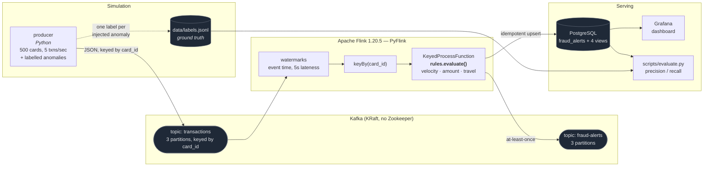
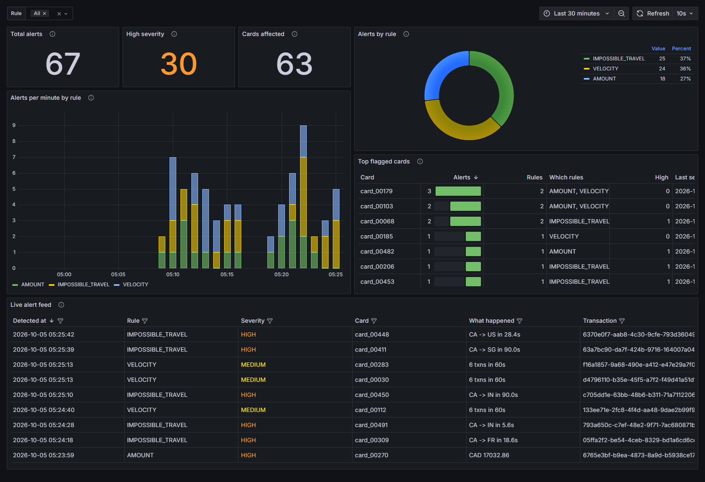
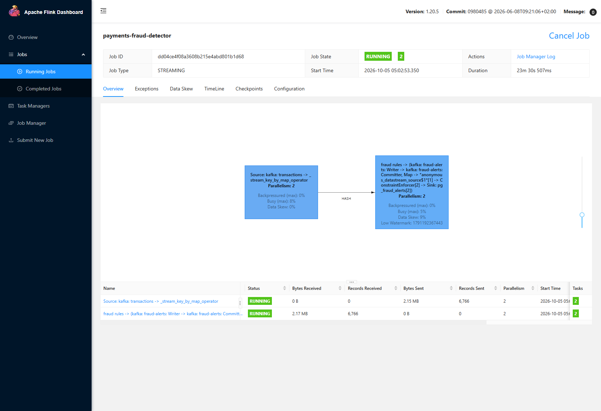
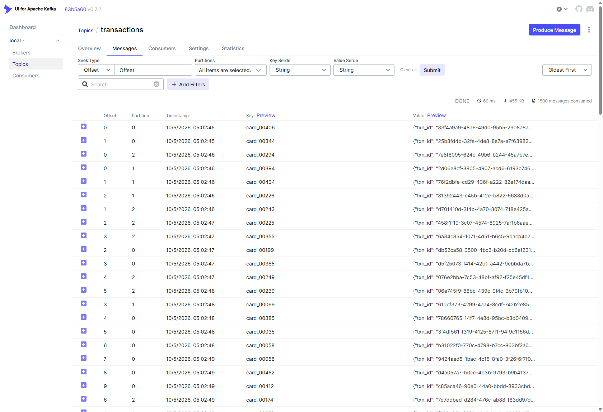
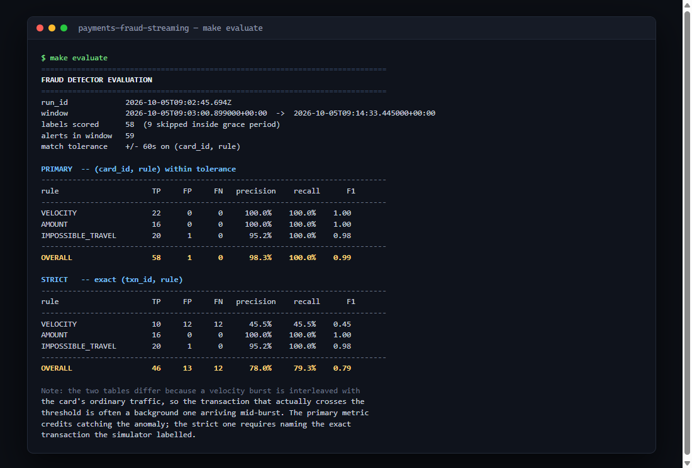

# payments-fraud-streaming

Real-time card fraud detection: a transaction simulator feeds Kafka, Apache Flink
(PyFlink) applies three fraud rules in event time, and alerts land in Kafka,
Postgres and a Grafana dashboard.

Everything is free, open source, and runs locally with one command. No cloud
accounts, and nothing to install but Docker — not even Python.

[](https://github.com/mayukhraj1994/payments-fraud-streaming/actions/workflows/ci.yml)

---

## The problem

Card fraud has to be caught in the seconds between authorisation and settlement.
Batch jobs are useless here: by the time a nightly job notices a card was used in
Toronto and Sydney twenty minutes apart, the money is gone.

That makes it a stream processing problem with three awkward properties:

1. **Events arrive out of order.** Terminals buffer, networks retry, partitions
   drain at different rates. A rule that trusts arrival order will both miss
   fraud and invent it.
2. **Decisions need memory.** "Six transactions in a minute" and "two countries
   in ten minutes" are statements about a card's recent history, not about a
   single transaction.
3. **Thresholds are not free parameters.** A rule that fires on ordinary traffic
   is worse than no rule, because a flooded alert queue gets ignored.

This project builds the pipeline, then measures it honestly against injected
ground truth.

---

## Architecture



| Component | What it does |
|---|---|
| [`producer/`](producer/) | Seeded simulator: 500 cards, lognormal amounts, three labelled anomaly injectors |
| [`flink_jobs/rules.py`](flink_jobs/rules.py) | **All rule logic, pure Python, no Flink import** |
| [`flink_jobs/fraud_detector.py`](flink_jobs/fraud_detector.py) | Flink wiring: source, watermarks, state, two sinks |
| [`sql/init.sql`](sql/init.sql) | `fraud_alerts` table plus four reporting views |
| [`grafana/`](grafana/) | Provisioned datasource and dashboard |
| [`scripts/evaluate.py`](scripts/evaluate.py) | Scores alerts against injected labels |

---

## Run it

Three commands:

```bash
git clone https://github.com/mayukhraj1994/payments-fraud-streaming.git
cd payments-fraud-streaming
docker compose up -d
```

That is genuinely all. Compose starts Kafka, creates the topics, starts Postgres
and applies the schema, brings up the Flink cluster, **submits the PyFlink job**,
starts the producer, and provisions Grafana.

Give it about a minute, then:

| Service | URL | Notes |
|---|---|---|
| Grafana | <http://localhost:3000> | Opens on the fraud dashboard. `admin` / `admin` |
| Flink UI | <http://localhost:8081> | The job graph, running |
| Kafka UI | <http://localhost:8082> | Browse both topics |
| Postgres | `localhost:5432` | `fraud` / `fraud` / db `fraud` |

> Kafka UI is on **8082**, not the usual 8080, which is commonly taken by other
> local stacks. Change the left side of the port mapping in
> [`docker-compose.yml`](docker-compose.yml) if you prefer.

### Everyday commands

`make` on Linux/macOS, `./make.ps1` on Windows (which has no `make`):

| Target | What it does |
|---|---|
| `up` / `down` | Start / stop the stack |
| `logs` | Follow all service logs |
| `produce` | Restart the producer (replays from the fixed seed) |
| `test` | Unit tests, **in a container** — no local Python needed |
| `lint` | `ruff check` |
| `evaluate` | Precision / recall against injected labels |
| `clean` | Stop and delete all volumes |

```bash
./make.ps1 evaluate     # Windows
make evaluate           # Linux / macOS
```

---

## Results

Measured on a clean run. Every number below is from the output in
[`docs/evaluation-run.txt`](docs/evaluation-run.txt) — none of it is estimated.

**Run:** 11.5 minutes · 4,263 transactions · 500 cards · 5 events/sec · seed 42
· 58 labelled anomalies scored.

### Primary metric — did we catch the anomaly?

Matched on `(card_id, rule)` within ±60s.

| Rule | TP | FP | FN | Precision | Recall | F1 |
|---|---:|---:|---:|---:|---:|---:|
| VELOCITY | 22 | 0 | 0 | **100.0%** | **100.0%** | 1.00 |
| AMOUNT | 16 | 0 | 0 | **100.0%** | **100.0%** | 1.00 |
| IMPOSSIBLE_TRAVEL | 20 | 1 | 0 | **95.2%** | **100.0%** | 0.98 |
| **Overall** | **58** | **1** | **0** | **98.3%** | **100.0%** | **0.99** |

### Strict metric — did we name the exact transaction?

Matched on exact `(txn_id, rule)`.

| Rule | TP | FP | FN | Precision | Recall | F1 |
|---|---:|---:|---:|---:|---:|---:|
| VELOCITY | 10 | 12 | 12 | 45.5% | 45.5% | 0.45 |
| AMOUNT | 16 | 0 | 0 | 100.0% | 100.0% | 1.00 |
| IMPOSSIBLE_TRAVEL | 20 | 1 | 0 | 95.2% | 100.0% | 0.98 |
| **Overall** | **46** | **13** | **12** | **78.0%** | **79.3%** | **0.79** |

**Why both tables are here.** A tolerant metric chosen by the person being
measured deserves a visible sanity check, so the script prints the strict one
too.

The gap is entirely in VELOCITY, and it is a labelling artifact rather than a
detection failure. The simulator labels the 6th transaction of an injected
burst, but the burst is interleaved with that card's ordinary traffic. When a
background transaction arrives mid-burst, *it* is the one that crosses "more
than 5 in 60s", so the alert names a different (correct, genuinely suspicious)
transaction than the label. Scoring on `txn_id` alone reports ~45% precision for
a detector that worked perfectly. The primary metric credits catching the
anomaly on the right card at the right time, which is what a fraud team acts on.

AMOUNT and IMPOSSIBLE_TRAVEL score identically under both, because those rules
fire on exactly the transaction that triggers them.

### Calibration: the result that nearly wasn't honest

The first full run produced **13,878 velocity alerts against 1,953 injected
bursts**. The job was correct. The *threshold was miscalibrated against the
traffic rate*.

At 20 events/sec across 500 cards, each card averages 2.4 transactions per 60s
window, so random Poisson clustering reaches 6 often enough to fire constantly:

| Events/sec | Mean txns per card per 60s | P(chance alert) | Verdict |
|---:|---:|---:|---|
| 20 | 2.40 | 9.6e-02 | floods the table |
| 10 | 1.20 | 8.0e-03 | still noisy |
| **5** | **0.60** | **3.8e-04** | shipped default |

Predicted ~11.6k chance alerts; observed 13,878 minus 1,953 genuine ≈ 11.9k.
That agreement is how the cause was *confirmed* rather than guessed.

The default is now 5 events/sec. [`tests/test_calibration.py`](tests/test_calibration.py)
encodes the arithmetic so it cannot silently drift back, and asserts a real
burst still fires — calibration must not be bought by making the rule blind.

Writing that test also corrected the maths. The rule counts the arriving
transaction *plus* the preceding window, so the chance rate is
`P(Poisson ≥ limit)`, not `P(Poisson > limit)`. The first version understated it
tenfold and predicted 0.8 alerts where the simulation produced 7.

---

## Design decisions

### Why DataStream, not Table API / SQL

Rule 3 needs to remember each card's last card-present country — that is keyed
state, DataStream's native idiom. In SQL it becomes an awkward self-join or a UDF
that smuggles state in anyway.

The deciding reason is testability. All rule logic lives in
[`flink_jobs/rules.py`](flink_jobs/rules.py) with **no Flink import**, so
[`tests/test_rules.py`](tests/test_rules.py) drives the real production logic
with plain dicts and no cluster. Rules written as SQL strings can only be tested
by standing Flink up, so in practice they get tested against a reimplementation —
which is worse than no test, because it can pass while the job is broken.

The job itself is deliberately thin: it owns I/O, watermarks and state *storage*,
and delegates every decision to `rules.evaluate()`.

### Why event time

Each transaction carries `event_time`, stamped when it occurred, and the job
assigns watermarks with 5 seconds of allowed lateness.

Processing time would mean the windows measure *when Flink read the data*, not
when the payments happened. Under any lag — a consumer restart, a backlog, a slow
partition — a burst spread over 8 real seconds could arrive in one batch and look
instantaneous, or spread across two windows and vanish. Event time also makes
replays deterministic: the same Kafka data produces the same alerts, which is
what makes `evaluate.py` meaningful at all.

**This constrained the simulator.** Anomalies are *scheduled forward* in time and
emitted when due, rather than written immediately with backdated timestamps.
Backdating was the easier implementation and would have placed burst events
outside the 5s lateness bound, where Flink drops them as late data — the detector
would have looked broken while never having been shown the events.

### Why key by `card_id`

Every rule is a statement about one card's history. Keying by `card_id`:

- sends all of a card's transactions to the same operator instance, in order, so
  per-card state is correct;
- partitions the work across the cluster — 500 cards spread over 3 partitions and
  2 task slots;
- keeps state naturally bounded, since each key holds only a 60-second window of
  timestamps plus one location.

Keying by `customer_id` would merge two cards' histories and invent velocity
alerts for a couple shopping simultaneously. Keying by `txn_id` would make every
key unique and no stateful rule could work at all.

### Exactly-once vs at-least-once

**This pipeline is at-least-once, by choice.**

Exactly-once to Kafka requires transactions, which hold alerts invisible to
consumers until a checkpoint completes — adding up to a full checkpoint interval
(10s here) of latency to a fraud alert. For a system whose entire value is
speed, that is the wrong trade.

Instead, duplicates are made harmless. `alert_id` is
`uuid5(txn_id, rule)` — derived from the data, not random — so a replayed
transaction produces a byte-identical alert id, and the Postgres sink upserts on
it. A duplicate costs nothing; the latency would have cost something real.

This is visible in the data: during one run the `fraud-alerts` topic held
**18,362** alerts while Postgres held **17,580** rows. That 782-row gap is
duplicate deliveries collapsed by the idempotent upsert, working exactly as
designed.

The trade-off is explicit: Postgres is a *materialised view* of the alert stream,
not the system of record. Kafka is the durable log. If Postgres is lost, replay
rebuilds it.

### Alert suppression

Each rule suppresses repeat alerts per card for its own window. One burst raises
one alert, not fifty.

This also fixes a real false positive. After a `CA → AU` travel alert, the
cardholder's next ordinary home transaction is *another* country change inside
the 10-minute window, and would alert again on every single trip.

### Impossible travel requires card-present

Only POS and ATM transactions set or test location. An online purchase from a
foreign merchant says nothing about where the cardholder physically is, and
treating it as a location is the largest false-positive source in this rule.

This forced a simulator fix: travel leg 1 originally picked a channel at random,
so roughly a third of injected anomalies would have been **undetectable by
construction** — and the reported recall would have been measuring a bug in the
test harness.

### Rolling window, not a sliding window

The brief said "sliding window". This implements a **rolling 60-second look-back
evaluated on every event** instead, and that is a deliberate deviation.

A sliding window only fires at window boundaries, so an alert arrives up to one
slide interval late, and a burst straddling two windows can be split and missed
entirely. The rolling check fires on the transaction that actually crosses the
threshold. It is still event-time driven and watermark-bounded, and it is
trivially unit-testable.

---

## Testing

```
72 passed
```

| File | Covers |
|---|---|
| [`test_anomalies.py`](tests/test_anomalies.py) | Burst timing, threshold margins, label placement, determinism, amount distribution |
| [`test_rules.py`](tests/test_rules.py) | All three rules, boundaries, suppression, state round-trip, end-to-end `evaluate()` |
| [`test_calibration.py`](tests/test_calibration.py) | Rate-vs-threshold arithmetic, simulated background traffic |

The rule tests were **mutation tested** rather than trusted for passing:

| Mutation | Caught |
|---|---|
| Velocity off-by-one (`<=` → `<`) | 2 failures |
| Remove the card-present check | 1 failure |
| Disable alert suppression | 3 failures |

A test that passes against broken code is worse than no test, so the suite was
verified to fail when the rules are wrong.

---

## Screenshots

All captured from the running stack described in [Results](#results).

### Grafana — the fraud dashboard



Alerts per minute stacked by rule, the rule mix, top flagged cards, and a live
feed. The feed's "What happened" column comes straight from `v_recent_alerts` —
`CA -> SG in 90.0s` is an injected impossible-travel anomaly caught end to end.

### Flink — the job running



Flink 1.20.5. The source chains into the keyed `fraud rules` operator via a HASH
partition on `card_id`, and that operator fans out to both sinks — the Kafka
writer/committer and `Sink: pg_fraud_alerts`. Note the **Low Watermark** value:
event time is advancing, which is what makes the windows meaningful.
Backpressure 0%.

### Kafka — the transaction stream



The `transactions` topic, keyed by `card_id` and spread across all three
partitions.

### Evaluation output



The output of `make evaluate`, rendered as a terminal for legibility. The text is
reproduced verbatim from [`docs/evaluation-run.txt`](docs/evaluation-run.txt).

---

## Notes and known constraints

- **Flink 1.20.5, not 2.x.** Flink is at 2.3.0, but PyFlink 2.x reshaped the
  DataStream API and the connector ecosystem has not caught up. 1.20 is the last
  1.x line; the image tag and `apache-flink` version match exactly.
- **PyFlink's DataStream `JdbcSink` is broken** against every published
  `flink-connector-jdbc` for Flink 1.18–1.20. It reflects on
  `JdbcOutputFormat.createRowJdbcStatementBuilder(int[])`, but 3.2.0 through
  3.4.0 all moved that static method to `RowJdbcOutputFormat`. Only 3.1.x — a
  Flink **1.17** build — still has it where PyFlink looks. Rather than gamble on
  cross-version binary compatibility, Postgres is written through the **Table API
  JDBC connector**, which is version-matched and supported.
- **The Table layer is string-only.** Carrying `detected_at` as
  `TIMESTAMP(3) WITH LOCAL TIME ZONE` fails at runtime with
  `Unsupported type:TIMESTAMP_LTZ(3)` — PyFlink cannot move that type across the
  DataStream/Table boundary. PostgreSQL does all the typing, which
  `stringtype=unspecified` already required for the `UUID` and `JSONB` columns.
- **The Flink image runs Python 3.10**, not the 3.11 used elsewhere — it is
  Ubuntu 22.04. `rules.py` is written for both: notably it normalises the
  trailing `Z` itself, since `datetime.fromisoformat` only accepts it on 3.11+.
  Ruff's `UP017` is disabled for `flink_jobs/` for the same reason — it would
  rewrite `timezone.utc` to the 3.11-only `datetime.UTC` and crash the
  TaskManager.
- **Editing `sql/init.sql` needs `make clean`.** The Postgres init hook only runs
  on an empty data directory.
- **The job reads from the earliest offset.** Reprocessing is harmless because
  alert ids are deterministic and the sink upserts, and it means a job started
  after the producer still sees every transaction.

---

## What I would do next

**Make the rules adaptive.** Fixed thresholds are the weakest part of this
design — as the calibration section shows, "more than 5 in 60s" is only
meaningful relative to a card's baseline. A per-card rolling baseline
(z-score against that card's own history) would catch a burst on a quiet card
while ignoring one on a genuinely busy account, and would not need recalibrating
when traffic volume changes.

**Add a real geo model.** "Different country" is a crude proxy. Using
coordinates and a maximum feasible travel speed would catch Toronto → Vancouver
in ten minutes, which this currently misses entirely, and would stop flagging a
legitimate land border crossing.

**Measure latency, not just accuracy.** The schema already records both
`detected_at` (event time) and `ingested_at` (wall clock), so end-to-end latency
is one query away — but it is not currently reported. For a fraud system, p99
detection latency matters as much as precision.

**Prove the recovery story.** The at-least-once argument above is reasoned, not
demonstrated. A chaos test that kills the TaskManager mid-burst and asserts no
alerts are lost and no duplicate rows appear would turn a design claim into
evidence.

**A feedback loop.** Real fraud systems have analysts confirming or dismissing
alerts. An outcome table and a precision-over-time panel would turn this from a
static rule engine into something that can be tuned against reality.

---

## Licence

[MIT](LICENSE)
